# Morse Code to ASCII Translation System using FPGA

<p align="center">


</p>

---

# Overview

This project presents a **real-time Morse Code to ASCII Translation System** implemented on the **AMD Xilinx Zynq-7000 FPGA** using **Verilog HDL**. The system receives Morse code inputs through the onboard push buttons, classifies each button press into a **dot** or **dash** based on its duration, decodes the Morse sequence into its corresponding ASCII character, stores the decoded characters in a string buffer, and displays the output using the **Vivado Virtual Input/Output (VIO)** interface.

The project demonstrates the complete FPGA design flow including RTL design, simulation, synthesis, implementation, timing verification, resource utilization analysis, power estimation, and on-board hardware validation.

---

# Features

- Real-time Morse Code to ASCII conversion
- Verilog HDL implementation
- AMD Xilinx Zynq-7000 FPGA implementation
- Finite State Machine (FSM) based controller
- Button press duration detection
- Lookup-table based Morse decoder
- String buffer for complete message storage
- Vivado VIO interface for real-time observation
- Functional simulation and hardware verification
- Timing constraints successfully met
- Low FPGA resource utilization
- Low on-chip power consumption

---

# Hardware and Software

| Item | Specification |
|------|---------------|
| FPGA Board | AMD Xilinx ZedBoard |
| FPGA Device | Zynq-7000 |
| HDL | Verilog |
| IDE | Xilinx Vivado |
| Input | Push Buttons |
| Output | Vivado VIO |
| System Clock | 100 MHz |
| Internal Clock | 2 Hz (Clock Divider) |

---

# Hardware Setup

The complete system was implemented on the AMD Xilinx ZedBoard. The onboard push buttons were used to enter Morse code sequences, while the decoded ASCII characters and complete messages were monitored in real time through the Vivado VIO interface.

<p align="center">

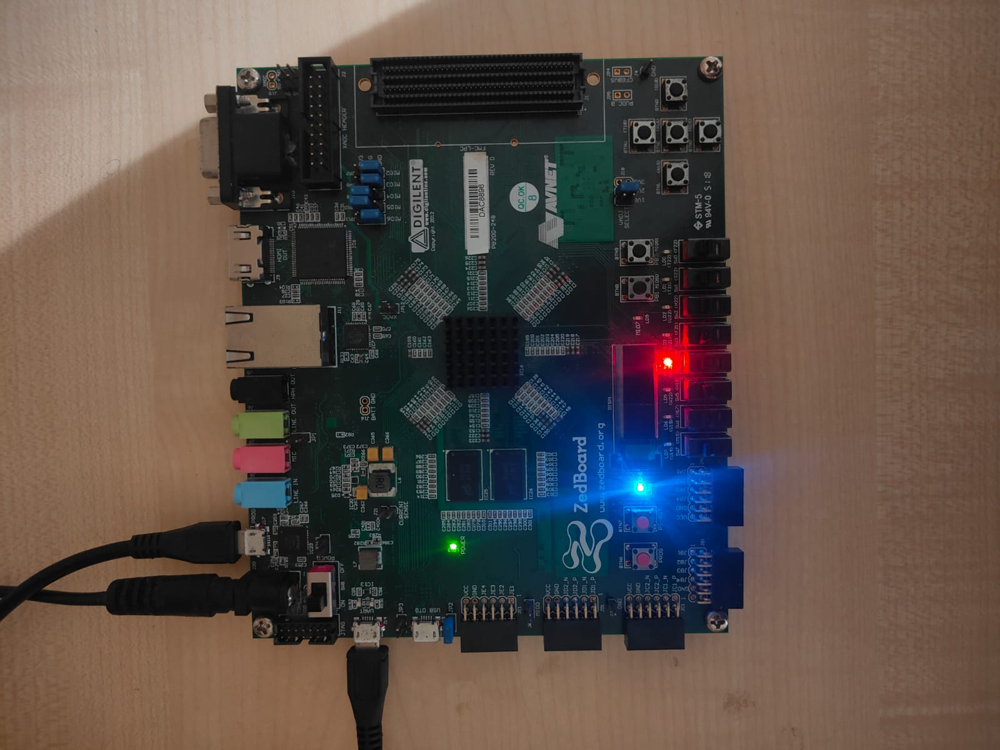

</p>

---

# System Architecture

<p align="center">

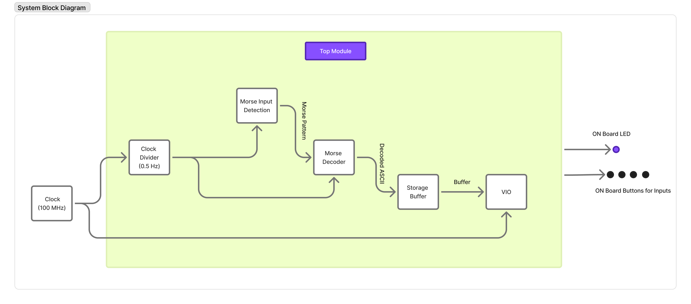

</p>

The overall design is divided into the following hardware modules:

- Clock Divider
- Morse Input Detection
- Morse Decoder
- String Storage Buffer
- Vivado VIO
- Top Module

The FPGA receives Morse code from the push buttons, converts it into binary Morse patterns, decodes the pattern into an ASCII character, stores the decoded character inside a string buffer, and displays the complete message through the Vivado VIO interface.

---

# Overall Project Flow

<p align="center">

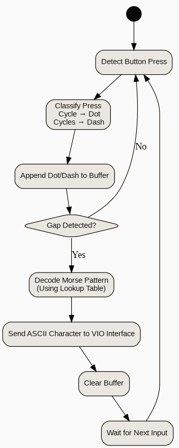

</p>

The overall operation is summarized below.

1. Detect button press.
2. Classify the press as Dot or Dash.
3. Append the detected symbol into the Morse pattern.
4. Detect character gap.
5. Decode the Morse pattern into ASCII.
6. Store the decoded ASCII in the string buffer.
7. Display the complete message using the VIO interface.

---
# Clock Divider

The onboard oscillator of the ZedBoard provides a **100 MHz** clock, which is too fast for direct human interaction using push buttons. To make button presses distinguishable, a **clock divider** is implemented that generates an internal clock of approximately **2 Hz**.

The divided clock slows down the system such that:

- Short button press → Dot (`.`)
- Long button press → Dash (`-`)

This ensures reliable detection of Morse symbols without requiring extremely precise human timing.

### Clock Divider Equation

\[
F_{out} = \frac{F_{in}}{2 \times DIV}
\]

where:

- \(F_{in}\) = 100 MHz
- \(F_{out}\) ≈ 2 Hz
- `DIV` is the counter limit.

A **28-bit counter** is used because it can count up to the required division value for generating the slower clock.

---

# Morse Input Detection

The module `morse_single_input.v` is responsible for converting push-button presses into Morse symbols.

The operation is performed in three stages:

1. **Button Press Detection**
   - Detect the rising edge of the push button.
   - Start counting the duration of the press.

2. **Duration Measurement**
   - If the button is released quickly, the input is classified as a **Dot**.
   - If the button remains pressed longer, it is classified as a **Dash**.

3. **Output Generation**
   - Generate a one-clock-cycle pulse on either `dot` or `dash`.

This module converts human button presses into digital Morse symbols that are used by the FSM.

---

# Finite State Machine (FSM)

<p align="center">

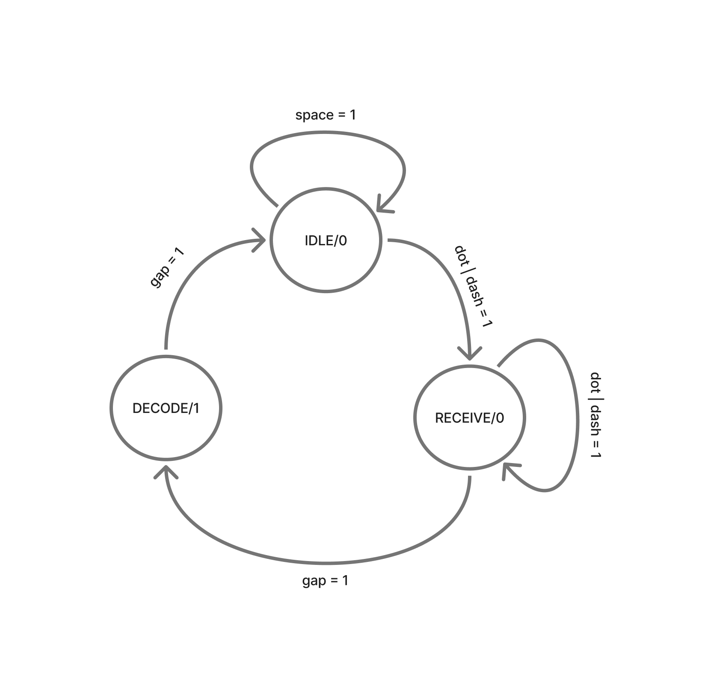

</p>

The controller is implemented using a **three-state Finite State Machine**.

## 1. IDLE State

- Waits for the first Morse symbol.
- Clears previous valid output.
- Initializes the Morse pattern.
- Transitions to the RECEIVE state when a dot or dash is detected.

---

## 2. RECEIVE State

- Continuously collects dots and dashes.
- Stores each symbol into the **5-bit Morse pattern register**.
- Increments the symbol counter after every received symbol.
- Remains in this state until a **gap** signal is detected.

---

## 3. DECODE State

- Sends the Morse pattern to the decoder.
- Receives the corresponding ASCII character.
- Stores the decoded ASCII character into the string buffer.
- Asserts the `valid` signal.
- Returns to the IDLE state for the next character.

---

# Morse Pattern Representation

Each Morse symbol is represented using binary values.

| Morse Symbol | Binary Representation |
|--------------|----------------------|
| Dot (`.`) | 0 |
| Dash (`-`) | 1 |

Example:

| Character | Morse | Binary Pattern |
|-----------|-------|---------------|
| E | . | 0 |
| T | - | 1 |
| A | .- | 01 |
| I | .. | 00 |
| S | ... | 000 |
| O | --- | 111 |

A **5-bit register** is sufficient because the longest supported Morse sequence consists of **five symbols**.

---

# Morse Decoder

The module `morsedecoder.v` converts the received Morse pattern into its corresponding ASCII character.

The decoder takes two inputs:

- **Morse Pattern**
- **Symbol Count**

Using both values, it uniquely identifies the entered character and generates the corresponding **8-bit ASCII value**.

For example:

| Morse Pattern | Symbol Count | ASCII |
|---------------|-------------|-------|
| 0 | 1 | E |
| 1 | 1 | T |
| 01 | 2 | A |
| 000 | 3 | S |
| 111 | 3 | O |

After decoding, the ASCII value is sent to the string storage module.

---

# String Storage

The decoded ASCII characters are stored sequentially inside a **256-bit string buffer**.

Instead of displaying only the latest character, the string buffer maintains the complete decoded message.

Example:

```
H

↓

HI

↓

HI M

↓

HI MO

↓

HI MOM
```

The buffer also supports insertion of spaces using the `word_gap` signal, enabling complete words and sentences to be displayed.

---

# RTL Schematic

<p align="center">

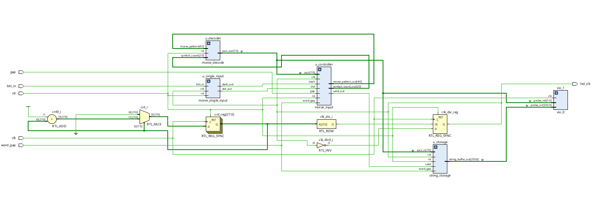

</p>

The RTL schematic generated by Vivado illustrates the synthesized hardware modules and their interconnections before technology mapping. It verifies that the design hierarchy has been correctly inferred from the Verilog HDL description.

---

# Implemented Design

<p align="center">

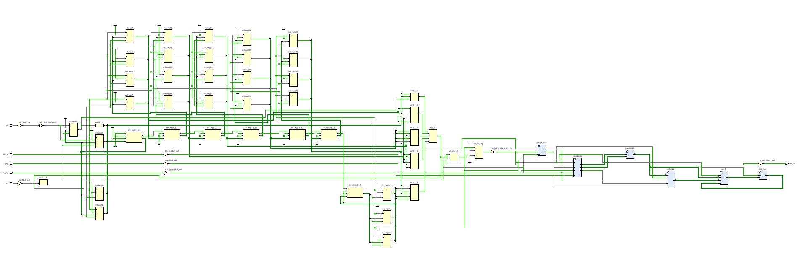

</p>

The implemented design represents the technology-mapped netlist after synthesis and optimization. It shows how the design has been mapped onto the FPGA resources.

---
# Functional Simulation

The design was verified through RTL simulation in Xilinx Vivado. The waveform confirms the correct classification of button presses into dots and dashes, proper FSM state transitions, successful Morse decoding, and storage of ASCII characters into the string buffer.

<p align="center">

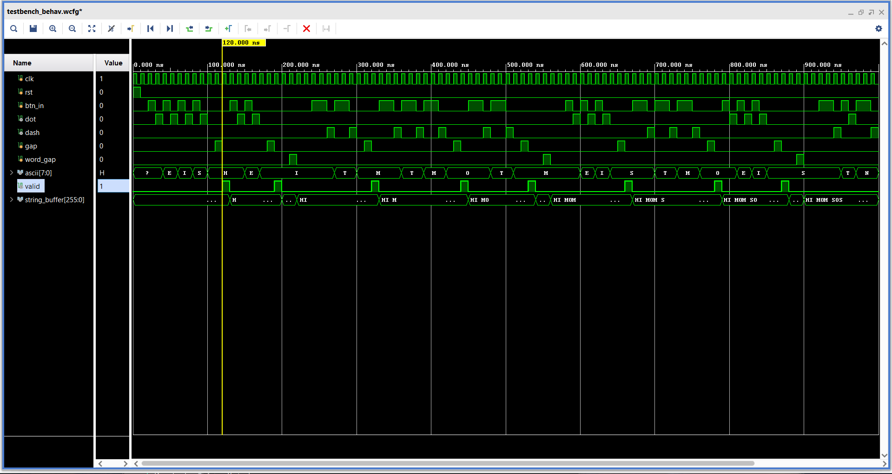

</p>

### Observations

- Clock operates correctly.
- Dot and Dash pulses are generated based on button press duration.
- Gap signal initiates decoding.
- ASCII values are generated correctly.
- The valid signal indicates successful decoding.
- The string buffer stores multiple decoded characters.

---

# Hardware Validation using Vivado VIO

After implementation on the FPGA, the decoded ASCII characters were monitored in real time using the Vivado Virtual Input/Output (VIO) interface.

<p align="center">

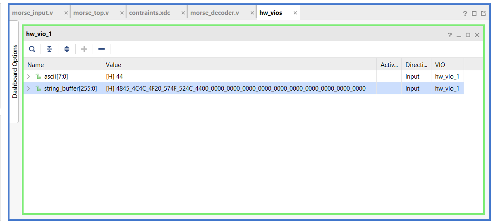

</p>

The VIO interface displays:

- Current decoded ASCII character.
- Complete decoded message stored inside the string buffer.

This provides an effective method for real-time hardware debugging without requiring additional external peripherals.

---

# Timing Analysis

The implemented design successfully meets all timing constraints.

### Timing Summary

<p align="center">

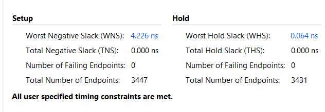

</p>

### Pulse Width Timing

<p align="center">

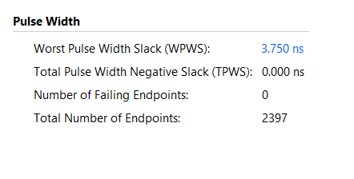

</p>

### Timing Results

| Parameter | Result |
|-----------|---------|
| Worst Negative Slack (WNS) | +4.226 ns |
| Worst Hold Slack (WHS) | +0.064 ns |
| Total Negative Slack (TNS) | 0 ns |
| Timing Violations | None |

Since both setup and hold slacks are positive, the design satisfies all timing requirements.

---

# FPGA Resource Utilization

The synthesized design occupies only a small percentage of the available FPGA resources.

<p align="center">

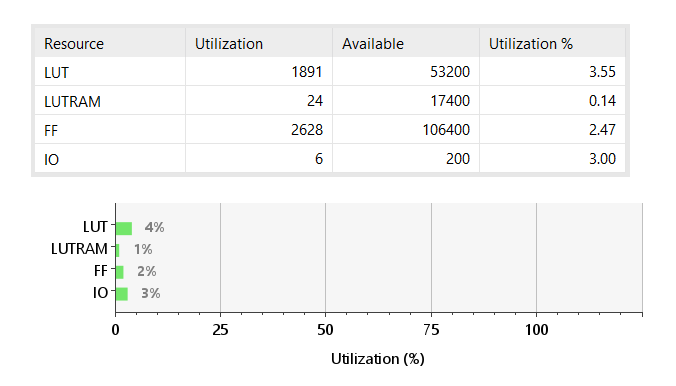

</p>

| Resource | Used | Available | Utilization |
|-----------|------|-----------|-------------|
| LUT | 1891 | 53200 | 3.55% |
| LUTRAM | 24 | 17400 | 0.14% |
| Flip-Flops | 2628 | 106400 | 2.47% |
| IO | 6 | 200 | 3.00% |

The low resource utilization allows future enhancements such as UART communication, LCD interfaces, or support for additional Morse symbols.

---

# Power Analysis

The implemented design consumes very low on-chip power.

<p align="center">

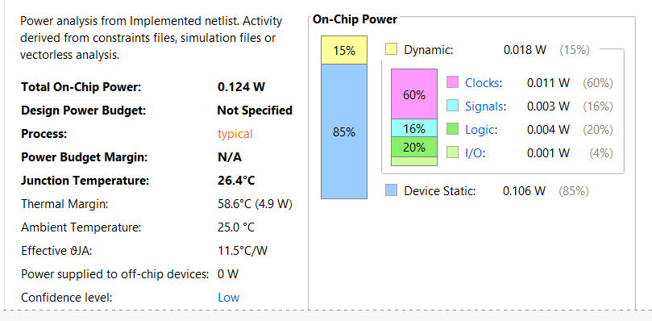

</p>

### Power Summary

| Parameter | Value |
|-----------|-------|
| Total On-Chip Power | 0.124 W |
| Dynamic Power | 0.018 W |
| Static Power | 0.106 W |

The low power consumption demonstrates the efficiency of the implemented design and makes it suitable for embedded FPGA applications.

---

# Results

The project was successfully implemented and verified on the AMD Xilinx ZedBoard.

### Achievements

- Successfully decoded real-time Morse code into ASCII characters.
- Verified functional correctness through RTL simulation.
- Implemented and validated on Zynq-7000 FPGA hardware.
- Successfully displayed decoded messages using Vivado VIO.
- Achieved timing closure with no setup or hold violations.
- Consumed less than 4% of the available FPGA resources.
- Demonstrated low on-chip power consumption.

---

# Future Improvements

The current implementation can be extended by adding:

- UART interface for serial communication.
- OLED or LCD display for standalone output.
- Audio-based Morse code detection.
- Bluetooth or Wi-Fi connectivity.
- Support for punctuation symbols.
- SD card logging of decoded messages.
- AXI-based peripheral integration.
- MicroBlaze processor interface.

---

# Repository Structure

```
Morse-Code-to-ASCII-Translator-on-FPGA
│
├── README.md
├── docs
├── images
├── src
├── tb
└── LICENSE
```

---

# Author

**Shiva Prasad Mishra**

M.Tech – Microelectronics & VLSI Design

BITS Pilani, Goa Campus

---

# License

This project is released under the MIT License.

---

## Acknowledgements

This project was developed as part of the Reconfigurable Computing course to demonstrate FPGA-based digital system design using Verilog HDL on the AMD Xilinx Zynq-7000 platform.
